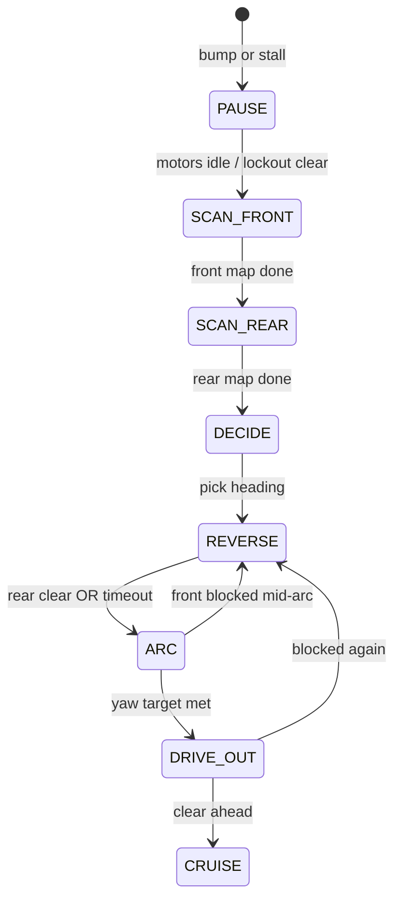

# Rover wander — behavior tiers (sign-off draft)

**Status:** Draft for Cain review — **do not implement until signed off.**  
**Brain:** dockerhost `rover_brain` → `explore_controller` + `rover_proximity`  
**ESP:** motors, safety, sensor execution — `microros_main.cpp`, `rover_sonar.cpp`, `motion_detect.cpp`  
**Trigger:** Go button on rover (no shell scripts for normal operation)

Hardware reference: `../lego-rover-esp32/WIRING.md`  
Stale doc (Pi-era): `ROVER_BEHAVIOR.md` — superseded by this file for wander design.

---

## Chassis offsets (Cain bench, Aug 2026)

| Measurement | Value | Used for |
|-------------|-------|----------|
| Sonar face → front bumper | **9 cm** | Convert sonar range → bumper clearance |
| Sonar pivot → rear axle line | **~14.5 cm** | Reverse distance estimates |
| Side VL53 → body side | **~4 cm** | Angled wall approach |
| Rear aux IR trip | **~8 cm** | Reverse stop before spin |

Env overrides: `ROVER_SONAR_TO_BUMPER_M`, `ROVER_TOF_TO_SIDE_M`, `ROVER_STOP_BUMPER_M`, etc.

---

## Golden rules

1. **ESP is last word on wheels** — E-stop, battery, stall lockout, sonar hard brake.
2. **Brain sends intent** — cruise curve, escape phases, scan requests. ESP executes scans and publishes data.
3. **Tiers are layers**, not separate apps — one `explore_controller` FSM; proximity is always on (Tier 0/1).
4. **Tier 3 only on bump or stall** — sonar proximity alone must not trigger full recover (that is Tier 1/2).
5. **No in-place spin when boxed** — if forward &lt; ~20 cm bumper clearance, reverse first.

---

## Tier overview

| Tier | When | Brain | ESP |
|------|------|-------|-----|
| **0 — Safety** | Always | — | E-stop, battery, stall lockout, cmd timeout |
| **1 — Room** | Cruise / wander, open space | `rover_proximity`: slow, steer to open side from pan wiggle + ToF | Pan sine wiggle, forward brake, spin block when close |
| **2 — Tight** | Approaching obstacle, not stuck yet | Stronger steer-away; optional short backup if closing fast | Same brakes; may zero angular |
| **3 — Recover** | **Bump or stall only** | Full scan → decide → reverse → arc → drive-out | Execute scans on request; ring + chime; rear IR sample |

**Current state (Aug 2026):** Tier 1 partially live (`rover_proximity` + ESP brake fixes). Tier 3 is **broken** — escape “SCAN” immediately picks a random IMU arc with no sensor sweep.

---

## Tier 1 & 2 (brief — already directionally agreed)

### Tier 1 — Room (default cruise)

- Inputs: `/rover/sonar/range`, `/rover/sonar/pan_deg`, `/rover/tof/left|right`, IMU.
- Pan wiggle ±12–22° stores left / centre / right buckets.
- **Forward:** slow above `slow_bumper` (~28 cm), stop below `stop_bumper` (~15 cm to bumper).
- **Angled wall:** side ToF &lt; ~14 cm → steer away even if centre sonar looks open.
- **Spin guard:** no in-place rotation when forward clearance &lt; ~20 cm bumper.

### Tier 2 — Tight (predictive)

- Closing rate: if range dropping &gt; 4 cm over 3 samples → treat as one tier closer.
- Optional **peek bias**: steer toward side with better recent glance / ToF (no full stop yet).
- Still no full escape — only shaping `cmd_vel`.

---

## Tier 3 — Recover (bump / stall)

### Purpose

Get unstuck **after contact or motor lockout** using a real sensor picture — not a blind spin. This is what people should *see* when it hits a wall: pause, scan (ring lights up), back up, turn toward open space, creep out.

### Triggers

| Event | Source | Notes |
|-------|--------|-------|
| **Bump** | ESP `/rover/bump` (front IR edge or IMU jerk) | Immediate Tier 3 |
| **Stall** | ESP `/rover/stall` (no ticks or slip ratio) | After ESP lockout (~4 s); brain waits or backs off gently |

**Not triggers:** sonar &lt; stop threshold, ToF alone, wander curve into wall (Tier 1/2 should prevent; if they fail repeatedly → consider bump/stall will fire anyway).

### Flood protection (keep existing)

- Max **3 escapes / 60 s** → pause 10 s, cruise straight.
- **Startup grace** 1.5 s after Go.
- **Event cooldown** 5 s after escape completes.

---

### Phase diagram

---

### Phase detail

#### T3.0 — PAUSE (0.3–0.8 s)

- Brain publishes **stop** `cmd_vel`.
- ESP: `rover_periph.notify_bump()` or `notify_stall()` — ring escape pattern, chime.
- Disable pan wiggle; hold sonar pan at centre.
- If stall lockout active: **wait** until ESP accepts motion again (do not fight lockout).

#### T3.1 — SCAN_FRONT (~4–6 s)

**Goal:** 180° sonar map — “what’s in front of me?”

| Step | Actor | Action |
|------|-------|--------|
| 1 | Brain | Publish `/rover/sonar/cal_sweep` = `true` (or new `escape_scan` topic) |
| 2 | ESP | Pan sweep **7 steps**: 0°, 30°, 60°, 90°, 120°, 150°, 180° (900 ms dwell each) |
| 3 | ESP | Publish `/rover/sonar/range` + `/rover/sonar/pan_deg` each dwell; ring shows `tick_sonar_map` colours |
| 4 | Brain | Record `(pan_deg, range_m)` pairs; filter invalid (&lt; 2 cm or &gt; 4 m) |
| 5 | ESP | Publish scan complete (extend: `/rover/sonar/scan_complete` Bool) |
| 6 | Brain | Publish `/rover/sonar/cal_sweep` = `false`; re-enable wiggle after recover |

**Note:** Today’s cal sweep is only **4 poses** (90→180→0→90). Tier 3 needs the **7-step** sweep above — small firmware extension.

**Bin filter (from old sonar escape):** When `min_range < stop`, ignore readings &gt; `max(0.70 m, min + 0.45 m)` so glances down a hallway don’t pick “open” through a nearby wall.

#### T3.2 — SCAN_REAR (~3–5 s)

**Goal:** Rear arc IR map — “where can I turn?”

| Step | Actor | Action |
|------|-------|--------|
| 1 | Brain | Sweep `/rover/servo/angle` 0° → 180° (7 steps, ~300 ms settle) |
| 2 | Brain | At each step: publish `/rover/ir/aux_sample` = `1`; wait for `/rover/ir/aux_result` |
| 3 | Brain | Build `hits[8]` ring map (blocked = IR tripped at ~8 cm) |
| 4 | ESP | Ring `radar_frame` equivalent during scan (already in `rover_periph` patterns) |

**Pi-era `rover_radar.py` logic ports here** using ROS topics — not Pi GPIO, not file bridge.

#### T3.3 — DECIDE (~50 ms, pure logic)

Fuse front sonar map + rear IR map + side ToF snapshot:

1. **Best forward escape angle** — pan angle with maximum range (after bin filter).
2. **Best rear gap** — clearest sector on rear sweep (`clearest_gap_led` / `pick_escape_spin` from `rover_radar.py`).
3. **Choose turn sign:**
   - Prefer rear gap bearing if front is boxed (`min_front &lt; 0.25 m` sonar).
   - Else prefer side with better ToF if one side &lt; 12 cm.
   - Else weighted blend: rear gap 60%, front best-bin 40%.
4. **Target yaw** for ARC phase: **45°–85°** (not 180° — no pirouette in a closet).
5. **Commit sign** for this escape — don’t flip mid-arc.

Log one line: `escape decide: front_min=0.12 best_pan=120 rear_gap=270 turn_L`.

#### T3.4 — REVERSE (0.8–1.6 s, adaptive)

| Rule | Value |
|------|-------|
| Linear | `-reverse_power` (~65% of cruise, floor 0.08) |
| Angular | 0° first 0.4 s, then slight steer toward commit sign (0.08–0.10) |
| **Stop reverse if** | Rear IR hit **or** front sonar opens (&gt; 0.35 m) **or** timeout |
| Carpet | Allow up to 1.6 s; if stall fires again → skip to ARC with wider angle |

**Critical:** Do not start ARC while rear IR says wall at 8 cm.

#### T3.5 — ARC (IMU-limited, 1.2–2.8 s)

| Rule | Value |
|------|-------|
| Linear | Small forward creep `0.11–0.22` (arc not spin) |
| Angular | Commit sign × `0.08–0.12` |
| Stop when | IMU yaw ≥ target − 8° **or** timeout |
| **Abort to REVERSE if** | Front sonar &lt; stop during arc **or** front IR bump |

Proximity layer **still active** during ARC (spin block, side ToF).

#### T3.6 — DRIVE_OUT (0.6–1.0 s)

- Forward at cruise × 0.8 toward best front bin heading (small steer trim).
- Sample sonar every 60 ms — if blocked, **one** re-reverse (max 2 per escape) then finish.
- On clear: → **CRUISE** with `straight_block` 10 s (existing).

#### T3.7 — Done

- Ring back to session cruise colours.
- `escape_event` counter++; flood check.
- Re-enable pan wiggle.

---

### ESP vs brain split (Tier 3)

| Responsibility | ESP | Brain |
|----------------|-----|-------|
| Pan sonar sweep | Execute steps, publish range | Request start/stop; consume map |
| Aux servo + rear IR | Move servo, pulse aux emitter, publish result | Orchestrate sweep sequence |
| Ring / speaker | Show scan, bump, stall, escape | Trigger via events already on ESP |
| Reverse / arc / drive-out motors | Ramp, heading hold, brakes | Publish `cmd_vel` phases |
| Stall lockout | 4 s motor cut | Wait, don’t publish forward until clear |

**ESP must not** run its own parallel escape FSM in production (removed from `rover_sonar.cpp` — brake only). One brain publisher for `cmd_vel`.

---

### ROS topics (Tier 3)

| Topic | Direction | Use |
|-------|-----------|-----|
| `/rover/bump`, `/rover/stall` | ESP → brain | Triggers |
| `/rover/sonar/cal_sweep` | brain → ESP | Start/stop front scan |
| `/rover/sonar/range`, `/rover/sonar/pan_deg` | ESP → brain | Front map samples |
| `/rover/sonar/scan_complete` | ESP → brain | **New** — scan done |
| `/rover/servo/angle` | brain → ESP | Aux head position |
| `/rover/ir/aux_sample` | brain → ESP | Pulse rear IR |
| `/rover/ir/aux_result` | ESP → brain | Hit bitmask |
| `/rover/tof/left`, `/rover/tof/right` | ESP → brain | Side snapshot at DECIDE |
| `/cmd_vel` | brain → ESP | Motion phases |
| `/rover/session` | brain → ESP | Session / ring mode |

---

### Parameters (defaults)

| Param | Default | Meaning |
|-------|---------|---------|
| `ROVER_T3_FRONT_STEPS` | 7 | Sonar scan poses |
| `ROVER_T3_FRONT_DWELL_MS` | 900 | Per-pose settle |
| `ROVER_T3_REAR_STEPS` | 7 | Aux IR sweep poses |
| `ROVER_T3_REVERSE_SEC` | 1.0 | Base reverse time |
| `ROVER_T3_REAR_CLEAR_M` | 0.10 | Rear IR + margin → bumper ~8 cm |
| `ROVER_T3_ARC_DEG_MIN` | 45 | Minimum escape turn |
| `ROVER_T3_ARC_DEG_MAX` | 85 | Maximum escape turn |
| `ROVER_T3_DRIVE_OUT_SEC` | 0.9 | Forward commit after arc |
| `ROVER_T3_MAX_RE_REVERSE` | 2 | Re-reverse attempts per escape |

---

### Carpet / stall specifics

| Situation | Behavior |
|-----------|----------|
| Stall on carpet, **zero wheel ticks** | Tier 3: longer reverse (1.6 s), **no ARC until rear IR clear** |
| Stall on hard floor, **slip** (slow ticks) | Treat as stall; reverse may need slightly higher power — ESP `STALL_SLIP_RATIO` tunable |
| Repeated stall in same escape | After 2nd stall → finish escape anyway with max arc + straight_block |
| Brain sends forward during lockout | ESP ignores — brain should gate on stall topic |

---

### What the user should see

1. Nose into wall → bump chime, ring flash.
2. **Pause** — wheels stop, pan sweeps left–right (visible), ring shows distance colours.
3. Aux head sweeps rear arc (visible on ring if rear scan wired).
4. **Reverse** — backs off wall.
5. **Smooth arc** — turns toward open side (not violent spin).
6. **Creeps forward** — resumes wander.

No laptop. No `ssh`. Press Go, watch it recover.

---

### Fleet portability (minis later)

| Piece | Rover | c3-mini (future) |
|-------|-------|------------------|
| Tier 1 proximity | `rover_proximity.py` | Same module, different offsets |
| Tier 3 front scan | Pan sonar sweep | Pan sonar sweep |
| Tier 3 rear scan | Aux IR + servo | May be sonar-only or rear ToF |
| Trigger | bump / stall | bump / stall |
| Parameters | env | `BOT_NAMESPACE` + per-bot env |

---

## Implementation order (after sign-off)

1. **Firmware:** 7-step front scan + `/rover/sonar/scan_complete` publish.
2. **Brain:** `tier3_recover.py` — scan orchestration (ROS-native rear IR, no Pi bridge).
3. **Wire:** Replace `_run_escape_scan()` fake in `explore_controller.py`.
4. **Bench:** wall box, carpet patch, angled approach — log decide line each escape.
5. **Tune:** arc degrees, reverse time, rear clear threshold.

---

## Sign-off checklist

- [ ] Tier 3 triggers **bump + stall only** — OK?
- [ ] 7-step front scan + rear IR sweep — OK?
- [ ] Reverse until rear clear before arc — OK?
- [ ] No full 180° spin-in-place when forward &lt; 20 cm — OK?
- [ ] Ring + chime during scan — OK?
- [ ] Parameters table — anything missing?

**Cain:** Reply with edits or “signed” and we implement.

---

## Change log

| Date | Change |
|------|--------|
| 2026-08-19 | Initial Tier 3 draft; chassis offsets; tier 0–2 summary; implementation gaps noted |
